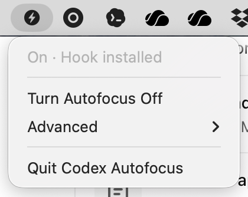

# codex-autofocus

`codex-autofocus` is a small macOS utility that brings the Codex desktop app to
the front when a Codex turn finishes.

It has two parts:

- a command-line helper that Codex runs from a `Stop` hook
- a menu bar app for turning the behavior on or off and repairing the hook setup



The helper is intentionally narrow. It does not read your Codex transcript, send
network requests, or control other apps. When it is enabled, it runs:

```sh
/usr/bin/open -b com.openai.codex
```

Each hook run also appends a short diagnostic line to:

```sh
~/.codex/codex-autofocus/debug.log
```

The log records timing, hook event metadata, thread and turn ids when Codex
provides them, and the result of the focus command. It deliberately avoids
writing prompt text or assistant message text.

Some Codex internals can also emit `Stop` hook events. When Codex sends a hook
payload with a null transcript path, `codex-autofocus` treats it as an internal
or ephemeral turn and skips bringing Codex forward. The skip is written to the
debug log.

## Requirements

- macOS 13 or newer
- Swift 5.9 or newer for building from source
- Codex hooks enabled in Codex

## Install

### Homebrew

Homebrew is the easiest install path once the tap is available:

```sh
brew tap jonasjancarik/tap
brew install codex-autofocus
codex-autofocus install --binary "$(brew --prefix codex-autofocus)/bin/codex-autofocus"
```

Start the menu bar app with:

```sh
codex-autofocus-menu
```

Homebrew formula apps do not always show up in Spotlight because the app bundle
lives under Homebrew's install prefix. To make `Codex Autofocus` available from
Spotlight, create a user Applications shortcut:

```sh
codex-autofocus install-app --app "$(brew --prefix codex-autofocus)/Codex Autofocus.app"
```

To start the menu bar app automatically, turn on `Open at Login` from the app
menu or run:

```sh
codex-autofocus enable-login-item --app "$(brew --prefix codex-autofocus)/Codex Autofocus.app"
```

This creates a per-user LaunchAgent. It starts the app when you log in to macOS,
which is the practical version of "start on boot" for a menu bar app.

The first command installs the helper and menu app. The `codex-autofocus install`
command registers the Codex hook. Codex may still ask you to approve that hook
before it runs.

### From Source

From the project directory:

```sh
scripts/install.sh
```

The installer builds the helper, copies it to `~/.codex/bin/codex-autofocus`,
and registers a managed `Stop` hook in `~/.codex/hooks.json`.

The installed hook looks like this:

```sh
'/Users/janca/.codex/bin/codex-autofocus' --hook --managed-by codex-autofocus
```

The `--managed-by codex-autofocus` marker is important. It lets this project find
and update only its own hook while leaving hooks from other tools alone.

If an older experimental `notify = codex-autofocus` setup is present, the
installer migrates away from it and restores the previous notifier when it can.

## Approve The Hook

Codex asks you to review new or changed hooks before it runs them. That is a
security step: hooks can run outside the sandbox.

After installing, open Codex's hook review UI and trust the Codex Autofocus
`Stop` hook. The menu bar app shows `Approve hook in Codex` until Codex has
recorded that trust.

There is also a manual option: `Advanced > Trust Installed Hook...`.
Use it only if you want Codex Autofocus to write the hook approval record directly
to `~/.codex/config.toml` instead of approving the hook through Codex's normal
review UI. The app shows a confirmation prompt first, and this is never done
automatically.

## Run The Menu Bar App

```sh
script/build_and_run.sh
```

This builds `dist/Codex Autofocus.app` and launches it as a menu-bar-only app.
The app has no Dock icon.

The bundle can also be built without launching it:

```sh
script/package_app.sh --configuration release
```

The menu is intentionally small:

- current state, such as `On · Hook installed`
- `Turn Autofocus On` or `Turn Autofocus Off`
- `Open at Login` or `Stop Opening at Login`
- `Advanced` repair and file actions
- `Quit Codex Autofocus`

Status refreshes automatically while the app is running. There is no manual
refresh command.

## Turn Autofocus On Or Off

The menu bar app is the easiest way to toggle autofocus.

The command-line helper can do the same thing:

```sh
~/.codex/bin/codex-autofocus enable --binary ~/.codex/bin/codex-autofocus
~/.codex/bin/codex-autofocus disable --binary ~/.codex/bin/codex-autofocus
```

Enable and disable only change Codex Autofocus runtime state. They do not edit
`~/.codex/hooks.json` or `~/.codex/config.toml`.

## Check Status

```sh
~/.codex/bin/codex-autofocus status --binary ~/.codex/bin/codex-autofocus
```

Status reports whether autofocus is enabled, whether the managed hook is
registered, which hook command is installed, and whether any setup issue needs
attention.

## Uninstall The Hook

```sh
scripts/uninstall.sh
```

This removes only hooks marked `--managed-by codex-autofocus` from
`~/.codex/hooks.json`. It does not remove unrelated hooks.

## Development

Useful commands:

```sh
swift build
swift test
swift run codex-autofocus --help
scripts/smoke.sh
```

`scripts/smoke.sh` removes and re-registers the managed hook, verifies that the
legacy `notify` setup is not active, toggles autofocus off and on, and runs dummy
hook invocations. It leaves the hook registered and autofocus enabled.

Project layout:

- `Sources/CodexAutofocusCore`: shared install, hook, status, and trust logic
- `Sources/CodexAutofocus`: command-line helper
- `Sources/CodexAutofocusMenuBar`: macOS menu bar app
- `Tests/CodexAutofocusCoreTests`: regression tests
- `docs/menu-bar-app.md`: notes on the menu bar app behavior
